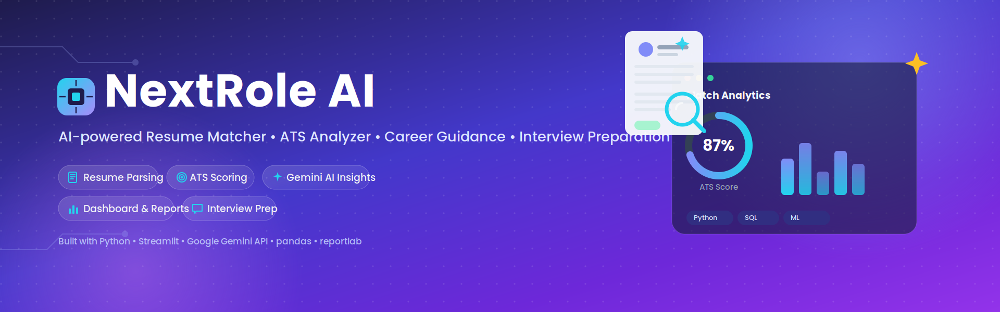
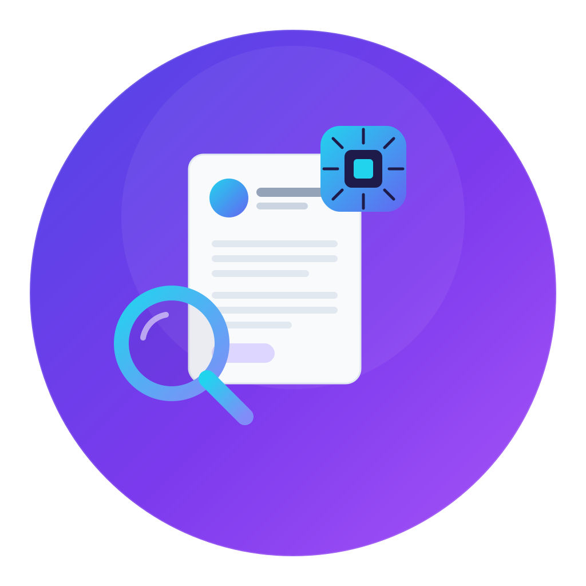
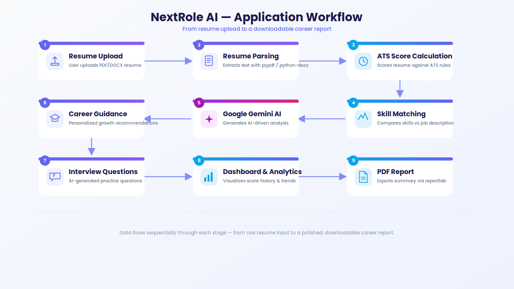
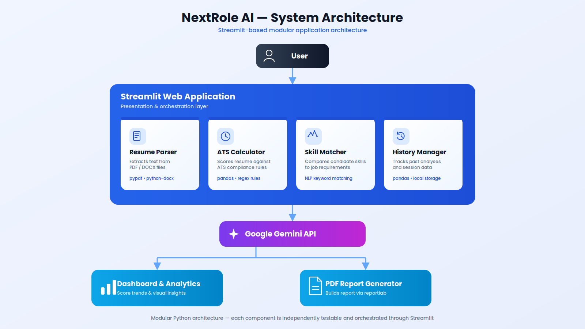
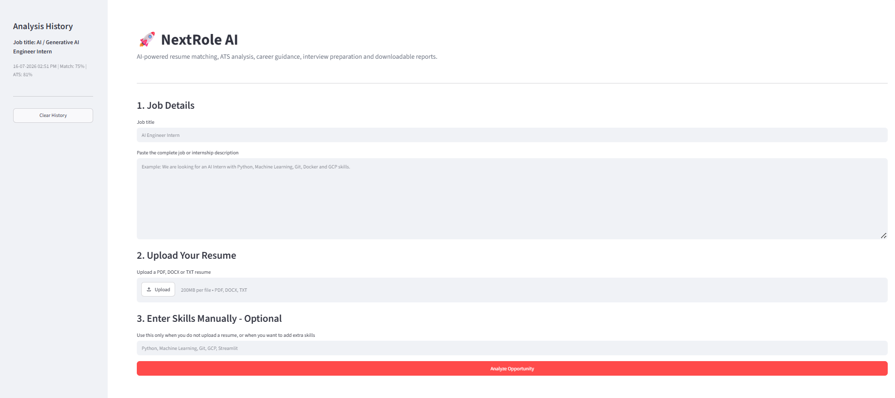
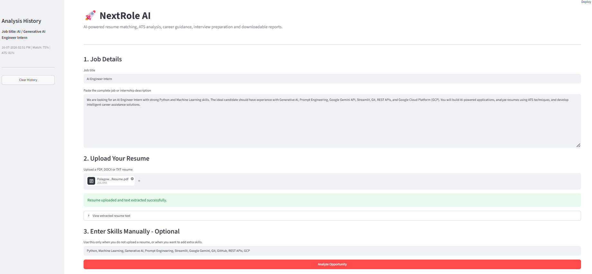
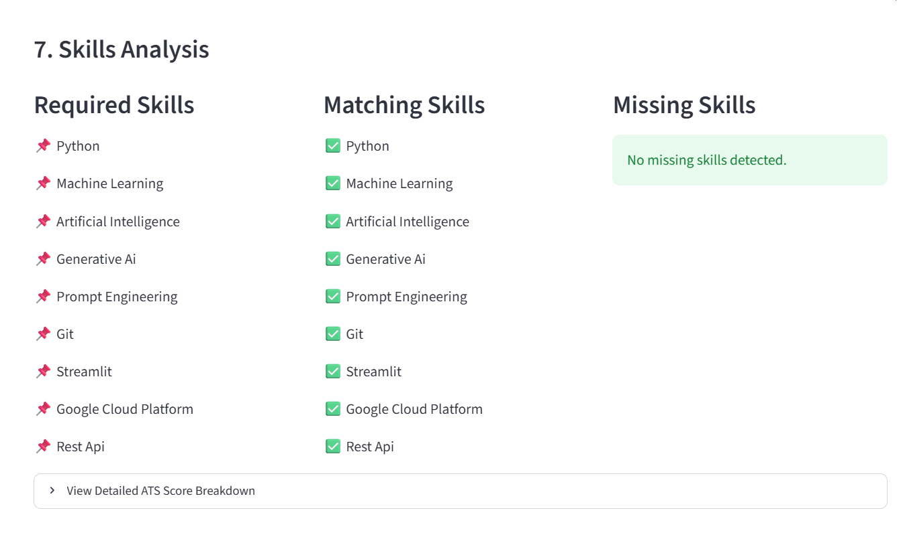
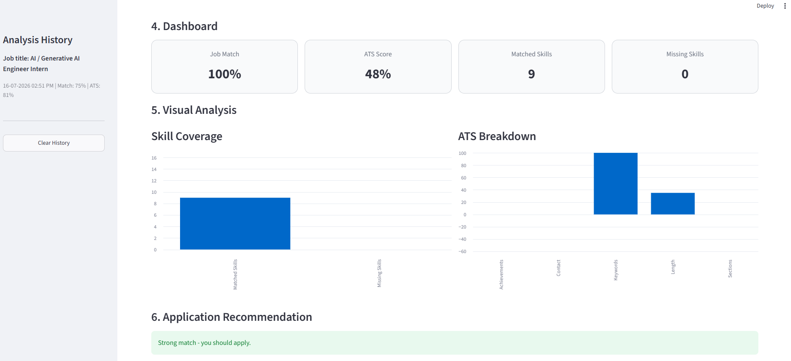
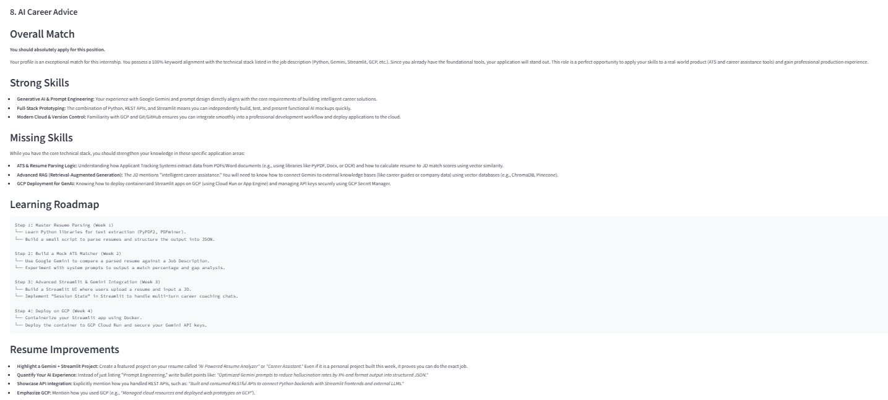
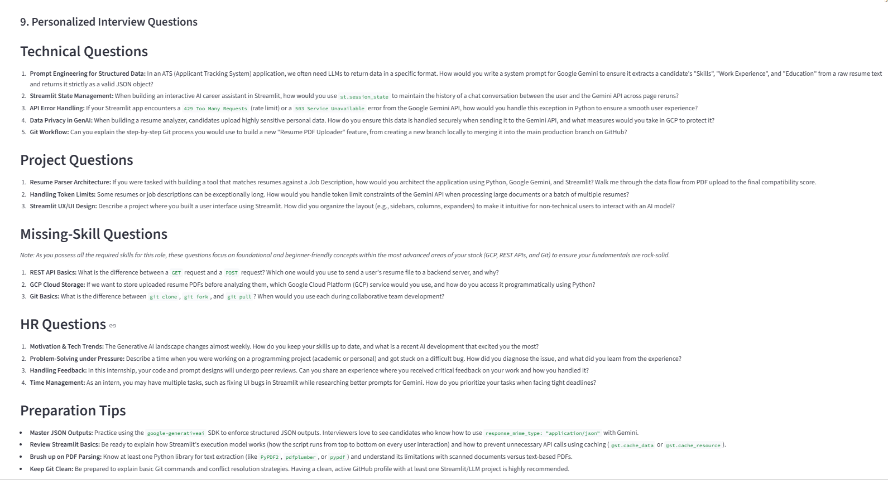

<p align="center">
  
</p>

<p align="center">
  
</p>

<h1 align="center">🚀 NextRole AI</h1>

<p align="center">
<b>AI-powered Resume Matcher • ATS Analyzer • Career Guidance • Interview Preparation</b>
</p>

<p align="center">


</p>

---

# 🌐 Live Demo

🔗 **https://nextrole-ai.streamlit.app/**

---

# 📖 Overview

**NextRole AI** is an AI-powered career assistant that helps students and job seekers evaluate resume compatibility with job descriptions.

The application extracts resume content, estimates an ATS-style score, matches skills against job requirements, identifies missing competencies, provides AI-powered career guidance using **Google Gemini**, generates personalized interview questions, visualizes insights through interactive dashboards, and creates downloadable PDF reports.

---

# ✨ Features

- 📄 Upload Resume (PDF, DOCX, TXT)
- 🎯 ATS Resume Score
- 📊 Job Match Percentage
- ✅ Skill Matching
- ❌ Missing Skill Detection
- 🤖 AI-Powered Career Guidance using Google Gemini
- 🎤 Personalized Technical, HR & Project Interview Questions
- 📈 Interactive Dashboard & Skill Analytics
- 📑 Downloadable PDF Report
- 🕒 Analysis History

---

# 🔄 Workflow

<p align="center">

</p>

---

# 🏗️ Architecture

<p align="center">

</p>

---

# 📸 Application Screenshots

## 🏠 Home Page

<p align="center">

</p>

---

## 📄 Resume Upload

<p align="center">

</p>

---

## 📊 Skills Analysis

<p align="center">

</p>

---

## 📈 Dashboard

<p align="center">

</p>

---

## 🤖 AI Career Guidance

<p align="center">

</p>

---

## 🎤 Personalized Interview Questions

<p align="center">

</p>

---

# 🛠️ Tech Stack

### Programming Language

- Python

### Framework

- Streamlit

### AI & LLM

- Google Gemini API

### Libraries

- google-genai
- pypdf
- python-docx
- pandas
- matplotlib
- reportlab
- python-dotenv

### Data Storage

- JSON

---

# 📂 Project Structure

```text
NextRole-AI/
│
├── assets/
│   ├── banner.png
│   ├── logo.png
│   ├── workflow.png
│   ├── architecture.png
│   ├── home.png
│   ├── upload.png
│   ├── analysis.png
│   ├── dashboard.png
│   ├── report.png
│   └── history.png
│
├── app.py
├── ai_analyzer.py
├── ats_calculator.py
├── history_manager.py
├── interview_generator.py
├── pdf_report.py
├── resume_parser.py
├── skill_matcher.py
├── requirements.txt
├── LICENSE
└── README.md
```

---

# 🚀 Installation

```bash
git clone https://github.com/laxmiprasannapolagowni/NextRole-AI.git

cd NextRole-AI

python -m venv venv

# Windows
venv\Scripts\activate

# Linux / macOS
source venv/bin/activate

pip install -r requirements.txt

streamlit run app.py
```

---

# 🔑 Environment Variables

Create a **`.env`** file in the project root and add your Google Gemini API key:

```text
GEMINI_API_KEY=YOUR_API_KEY
```

---

# 💡 Future Enhancements

- 🤖 AI Resume Builder
- 📝 AI Cover Letter Generator
- 📊 Resume Ranking System
- 🏢 Company-wise ATS Analysis
- 🎙️ Voice-Based Mock Interviews
- 🌍 Multi-language Support
- 👨‍💼 Recruiter Dashboard

---

# 👩‍💻 About the Author

## Polagowni Laxmiprasanna

Final-Year **B.Tech (Information Technology)** student at **CMR Engineering College, Hyderabad**, passionate about **Artificial Intelligence, Generative AI, Machine Learning, and Software Development**.

**NextRole AI** was built to help students and job seekers improve their resumes, identify skill gaps, understand job readiness, and prepare confidently for interviews using AI-powered insights.

---

# 📬 Contact

📧 **Email**

laxmiprasannapolagowni@gmail.com

💼 **LinkedIn**

https://www.linkedin.com/in/laxmiprasannapolagowni/

💻 **GitHub**

https://github.com/laxmiprasannapolagowni

🌐 **Live Demo**

https://nextrole-ai.streamlit.app/

---

# 📄 License

This project is licensed under the **MIT License**. See the **LICENSE** file for more details.

---

<p align="center">
⭐ If you found this project useful, consider giving it a star on GitHub!
</p>
